# jikim 사용자 가이드

이 문서는 jikim `v0.2.11` 관리 화면을 실제로 쓰는 사람을 위한 안내입니다. 화면 캡처는 모두
`jikim:v0.2.9` 이미지를 전용 PostgreSQL과 함께 띄운 뒤 데모 데이터를 넣고 찍은 것입니다.

서비스를 설치하고 지키는 쪽은 [관리자 가이드](ADMIN_GUIDE.md)를 보십시오. API와 MCP로
연동할 때는 [API 및 MCP 가이드](guides/api-guide.md)를 함께 봅니다.

---

## 1. 이 제품이 하는 일

jikim은 애플리케이션이 쓰는 자격 증명을 사람이 관리할 수 있는 형태로 모아 두는 서비스입니다.
데이터베이스 비밀번호, OAuth Client Secret, 오브젝트 스토리지 키처럼 코드나 설정 파일에
흩어져 있던 값을 한 곳에 암호화해 보관하고, 누가 언제 무엇을 꺼내 갔는지 기록합니다.
저장되는 값은 PostgreSQL에 들어가기 전에 AES-256-GCM으로 암호화되며 관리 화면은 기본적으로
모든 값을 마스킹해서 보여 줍니다.

단순한 값 보관함과 다른 점은 **시크릿을 경로만으로 두지 않는다**는 것입니다. 각 시크릿에는
쓰는 애플리케이션, 환경(DEV·STG·PRD), 책임자(Owner)와 태그가 붙고, 그 조합으로 위험 점수가
계산됩니다. 그래서 "이 값을 바꾸면 어떤 서비스가 영향을 받는가"를 값을 열어 보지 않고도
판단할 수 있습니다.

쓰는 사람은 네 종류입니다. 일반 사용자는 자기 권한 범위의 시크릿을 찾아보고 등록·변경합니다.
팀장은 관리자가 승인 절차를 켠 경우 다른 사람의 변경 요청을 검토합니다. 감사자는 값이 아니라
기록을 봅니다. 서비스 관리자는 계정·정책·연동을 설정합니다. 화면 오른쪽 위 프로필에 지금
자신의 역할이 `서비스 관리자`·`팀장`·`감사자`·`일반 사용자` 중 무엇인지 표시됩니다.

---

## 2. 처음 5분

로그인부터 시크릿을 하나 등록해 보는 데까지 한 번에 따라 할 수 있는 길입니다.

### 2.1 로그인한다

관리자가 알려 준 주소로 접속하면 로그인 화면이 나옵니다.

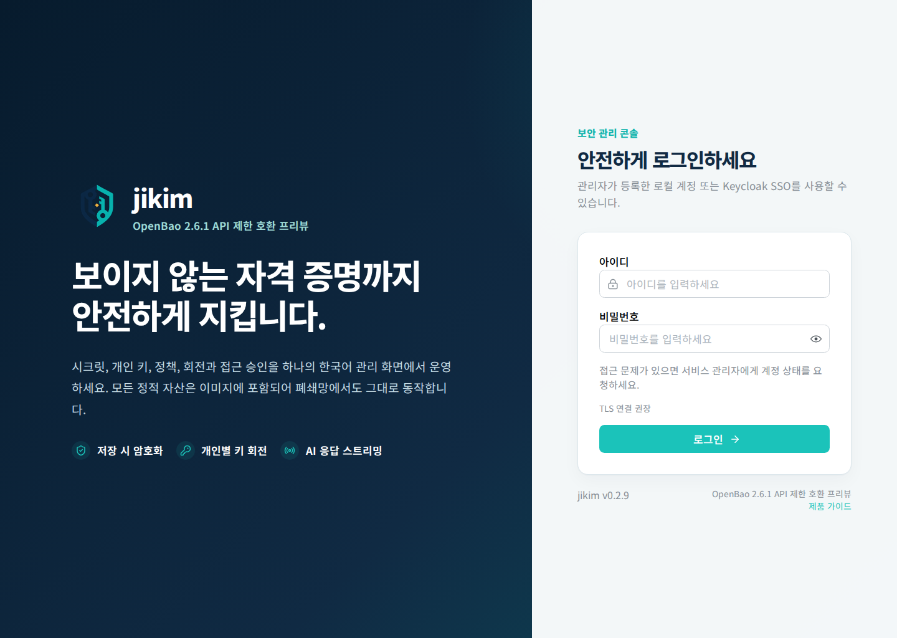

1. **아이디**와 **비밀번호**에 관리자가 발급한 계정을 입력하고 **로그인**을 누릅니다.
2. 관리자가 Keycloak SSO를 켰다면 입력란 아래에 **Keycloak SSO로 로그인** 버튼이 함께
   보입니다. 위 캡처는 SSO를 켜지 않은 상태라 버튼이 없습니다.
3. 카드 아래쪽의 `jikim v0.2.11`이 관리자가 안내한 버전과 같은지 확인합니다. 다르면 접속
   주소를 잘못 찾았을 수 있습니다.

비밀번호는 jikim 운영자에게도 알려 주지 않습니다. 로그인이 계속 실패하면 접속한 주소와 시각만
관리자에게 전달하십시오.

### 2.2 대시보드에서 현재 상태를 본다

로그인하면 **대시보드**로 들어옵니다.

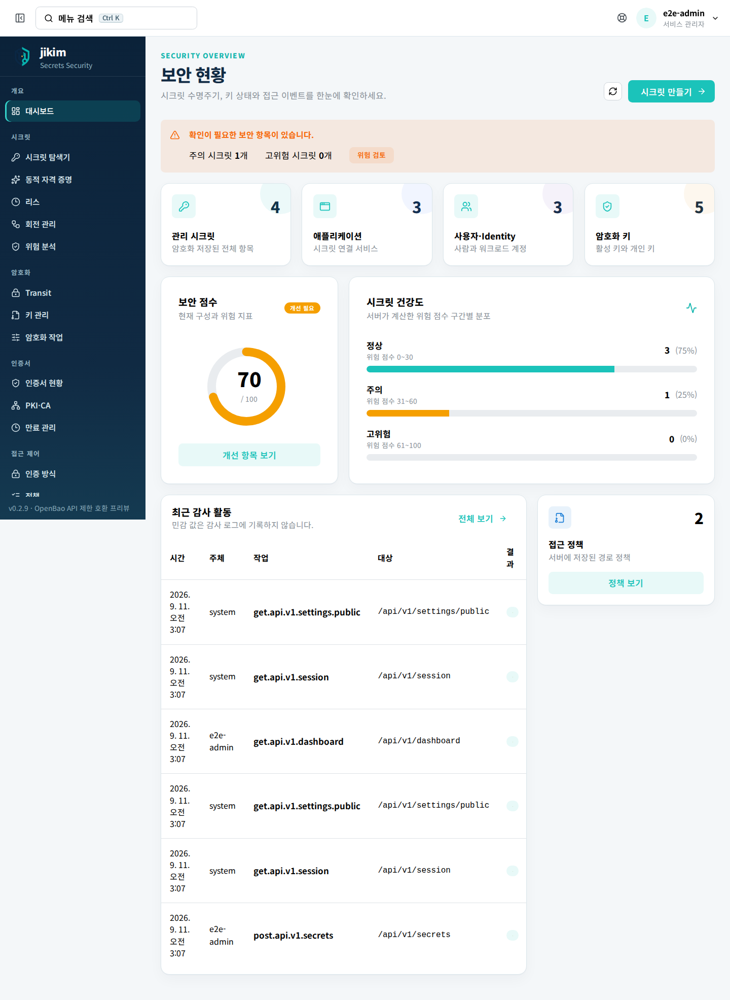

- 위쪽 카드 네 개는 **관리 시크릿**, **애플리케이션**, **사용자·Identity**, **암호화 키** 개수입니다.
- **보안 점수**는 현재 구성과 위험 지표로 계산한 100점 만점 값입니다. **개선 항목 보기**로
  무엇이 점수를 깎았는지 확인합니다.
- **시크릿 건강도**는 위험 점수를 정상(0\~30)·주의(31\~60)·고위험(61\~100)으로 나눈 분포입니다.
- **최근 감사 활동**에는 방금 자신이 한 로그인까지 바로 올라옵니다. 시크릿 평문은 여기에
  기록되지 않습니다.

### 2.3 시크릿을 하나 등록한다

왼쪽 메뉴 **시크릿 → 시크릿 탐색기**로 이동한 뒤 오른쪽 위 **시크릿 만들기**를 누릅니다.

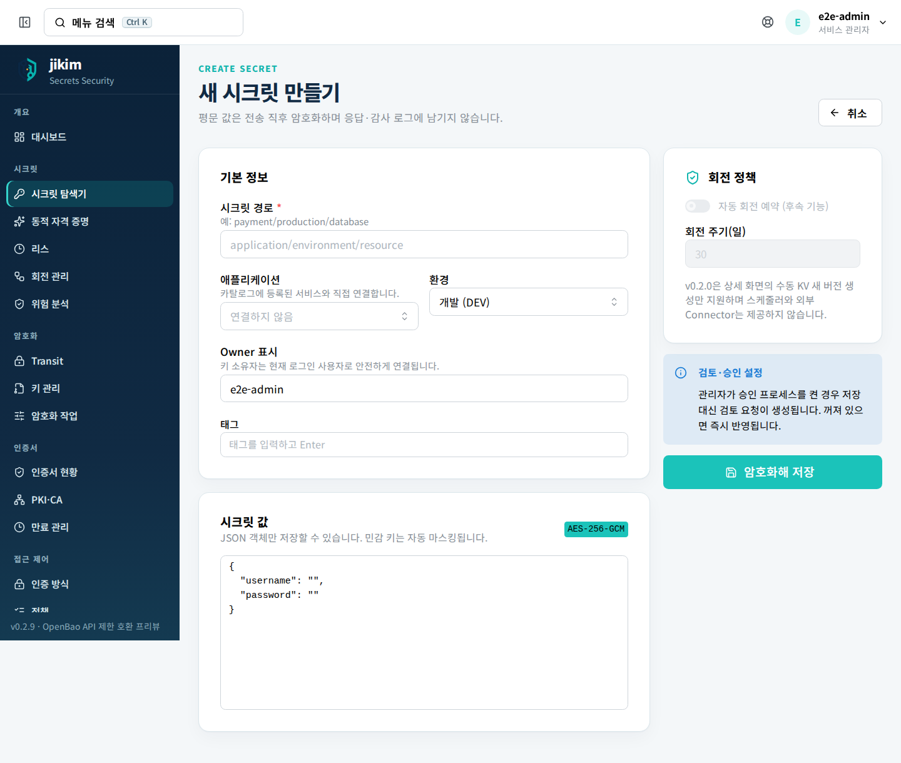

1. **시크릿 경로**에 `application/environment/resource` 형태로 씁니다. 예: `payment/production/database`.
2. **애플리케이션**은 카탈로그에 등록된 서비스에서 고릅니다. 기본값은 `연결하지 않음`입니다.
3. **환경**은 `개발 (DEV)`·`스테이징 (STG)`·`운영 (PRD)` 중에 고릅니다.
4. **Owner 표시**는 로그인 계정으로 채워져 있습니다. 담당 조직 이름으로 바꿔 두면 나중에
   검색과 인수인계가 쉽습니다. 비우면 위험 점수가 올라갑니다.
5. **태그**는 입력하고 Enter를 눌러 추가합니다. 나중에 검색에 쓰입니다.
6. **시크릿 값** 칸에는 JSON 객체만 넣을 수 있습니다. `{ "username": "", "password": "" }`
   틀이 미리 들어 있으니 값만 채웁니다. 평문 값은 전송 직후 암호화되고 응답이나 감사 로그에
   남지 않습니다.
7. 오른쪽 **회전 정책**의 **자동 회전 예약**은 후속 기능이라 켤 수 없습니다. `v0.2.11`은 상세
   화면의 수동 새 버전 생성만 제공합니다.
8. **암호화해 저장**을 누릅니다.

저장하면 목록으로 돌아옵니다. 관리자가 승인 절차를 켜 두었다면 저장 대신 검토 요청이
만들어집니다 — 오른쪽 **검토·승인 설정** 안내가 지금 어느 쪽인지 알려 줍니다.

### 2.4 등록한 값을 확인한다

목록에서 그 줄을 두 번 누르거나 오른쪽 `⋯` → **상세 보기**를 고르면 상세 화면이 열립니다.

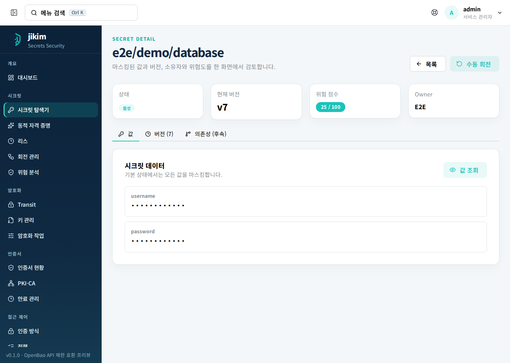

**값 조회**를 누르면 조회 사유를 3\~500자로 입력하는 창이 뜨고, 사유와 함께 조회 기록이 감사
로그에 남습니다. 확인이 끝나면 화면을 벗어나 다시 마스킹 상태로 돌립니다. 여기까지가 처음
5분입니다.

---

## 3. 화면별 사용법

왼쪽 메뉴는 개요·시크릿·암호화·인증서·접근 제어·애플리케이션·감사·관측·도구·인프라·관리
묶음으로 나뉩니다. 역할에 없는 메뉴는 아예 표시되지 않습니다. 상단 검색창(`Ctrl K`)에서 메뉴
이름으로 바로 이동할 수도 있습니다.

일부 메뉴는 제품 방향을 보여 주는 **프리뷰 화면**입니다. 화면이 있다는 이유로 그 기능이
동작한다고 판단하지 마십시오. 각 화면 위쪽 배지와 안내 문구가 실제 지원 범위를 말해 줍니다.

### 3.1 시크릿 탐색기

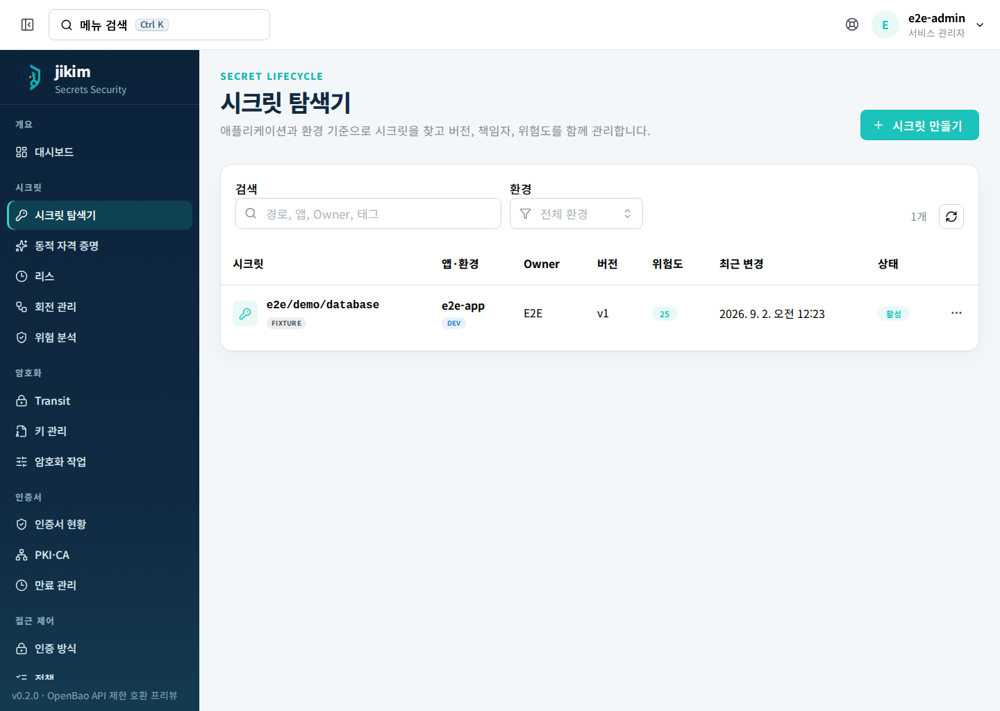

- **검색**에 경로, 앱 이름, Owner, 태그를 넣어 좁힙니다. **환경** 선택으로 PRD만 볼 수도 있습니다.
- **위험도** 숫자가 클수록 먼저 손봐야 하는 값입니다. 운영 경로, Owner 없음, `root`·`admin`
  같은 필드 이름이 점수를 올립니다.
- 줄을 두 번 누르면 상세 화면으로 들어갑니다. 오른쪽 `⋯`에는 **상세 보기**와 **격리**가 있습니다.
- 목록 조회 권한과 값 복호화 권한은 다를 수 있습니다. 목록에 보이는데 값이 열리지 않는 것은
  정상 동작입니다.

### 3.2 시크릿 상세

상세 화면은 **값**, **버전**, **의존성(후속)** 탭으로 나뉩니다.

- **값 조회**: 사유를 남기고 현재 버전 값을 확인합니다.
- **값 변경**: 새 값과 변경 사유를 적어 새 버전을 만듭니다. 이전 버전은 남습니다.
- **수동 회전**: 자동 회전 가능한 필드를 난수로 바꿔 새 버전으로 저장합니다. 대상
  데이터베이스나 외부 API에 반영하지는 않으므로 회전 후 대상 쪽 반영은 직접 해야 합니다.
- **격리**: 더 쓰지 않을 시크릿을 비활성으로 만듭니다. 확인 창이 "즉시 영구 삭제되지 않습니다"라고
  알려 주는 대로, 기록과 이전 버전은 남습니다.

### 3.3 개인 키 관리

프로필 메뉴의 **내 키·권한**입니다.

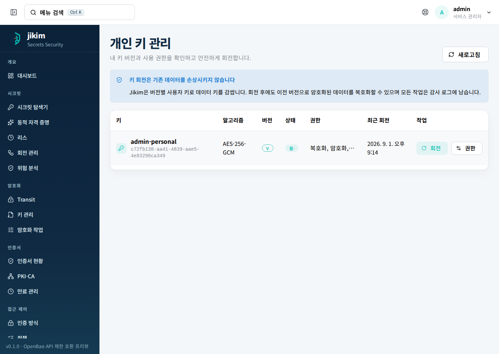

- 사용자마다 개인 키가 하나 있고 회전하면 버전이 올라갑니다. 회전 후에도 이전 버전으로
  암호화된 데이터는 계속 복호화됩니다.
- **권한**에서 이 키로 허용할 작업을 고릅니다. `복호화`는 기존 시크릿을 계속 읽기 위해 필요하므로
  제거할 수 없습니다.
- 회전 전에 이전 버전을 쓰는 데이터가 있는지, 진행 중인 다른 회전 작업이 없는지 확인합니다.
- 회전은 마스터 암호화 키(`ENCRYPTION_KEY`) 교체와 전혀 다른 작업입니다. 혼동하지 마십시오.

### 3.4 접근 정책

`admin`·`manager`·`auditor`만 볼 수 있는 화면입니다.

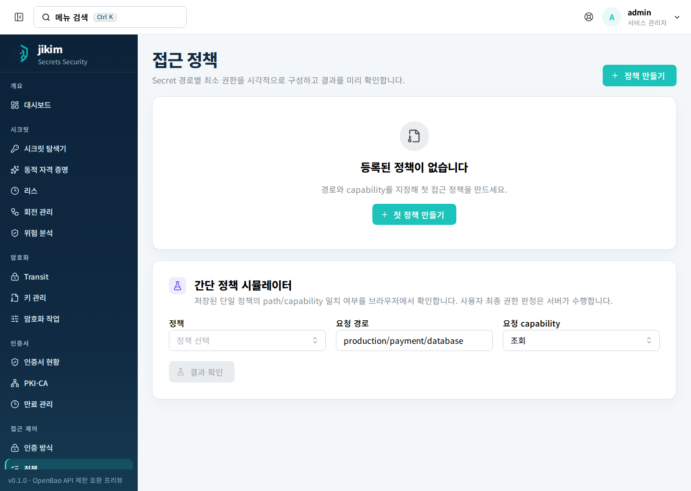

- 정책은 경로 패턴과 capability(`생성`·`조회`·`변경`·`삭제`·`목록`·`회전`·`암호화`·`복호화`)
  조합입니다. 카드의 사람 아이콘으로 정책을 적용할 사용자를 지정합니다.
- **정책 시뮬레이터**에 사용자·요청 경로·요청 capability를 넣고 **서버에서 판정**을 누르면
  실제 정책 엔진이 내리는 결론을 미리 볼 수 있습니다. 역할 우회(`admin`·`manager`는 항상 통과,
  `auditor`는 목록만)도 함께 표시됩니다.
- 권한 문의를 받았을 때 정책 파일을 읽는 대신 이 시뮬레이터 결과를 근거로 답하는 편이 정확합니다.

### 3.5 검토·승인

관리자가 승인 워크플로를 켠 경우에만 메뉴에 나타납니다. 꺼져 있으면 화면을 직접 열어도
다음과 같이 안내만 표시됩니다.

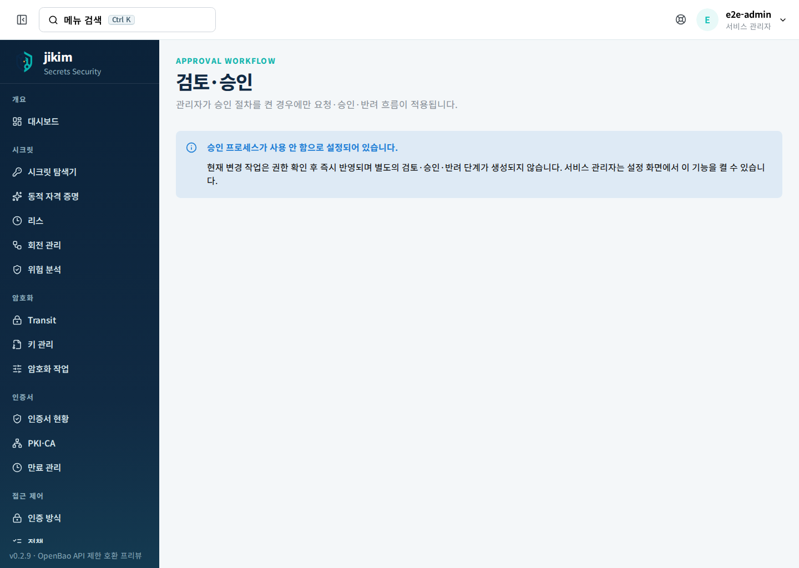

켜져 있을 때 `manager` 또는 `admin` 역할이면 다음을 확인하고 승인·반려합니다.

- 요청자 ID, 대상 경로, 작업 종류
- 요청자가 지금도 그 경로에 대한 권한을 갖고 있는지
- 시크릿 값 자체가 아니라 변경의 목적과 정책 적합성

자기가 만든 요청은 승인할 수 없습니다. 승인은 1인 검토이고 Break Glass 우회는 없습니다.
반려된 요청은 사유를 확인하고 새 요청으로 다시 제출합니다. `v0.2.11`의 시크릿 제출 화면에는
요청 사유 입력란이 없으므로, 검토자는 요청자·작업·대상 경로를 근거로 판단하고 승인·반려할 때
검토 의견을 남깁니다.

### 3.6 감사 로그

`admin`·`manager`·`auditor`가 볼 수 있습니다.

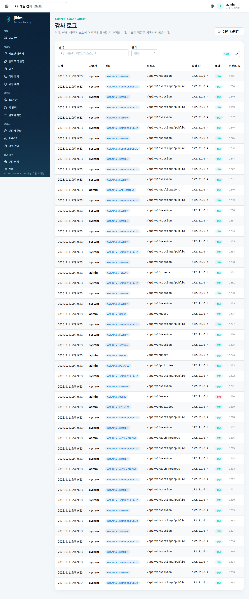

- **검색**에 사용자·작업·리소스·IP를 넣고, **결과**로 성공·실패·거부를 걸러 봅니다.
- **CSV 내보내기**로 지금 보이는 목록을 내려받습니다. 파일 이름은 `jikim-audit-<날짜>.csv`입니다.
- 시크릿 평문은 기록되지 않습니다. 조회·변경 사유와 대상 경로, 요청 ID만 남습니다.
- 오류를 신고할 때는 **이벤트 ID**와 시각을 함께 전달하면 관리자가 바로 찾을 수 있습니다.

### 3.7 AI 보안 도우미

관리자가 AI 연동을 켠 경우에만 실제로 응답합니다.

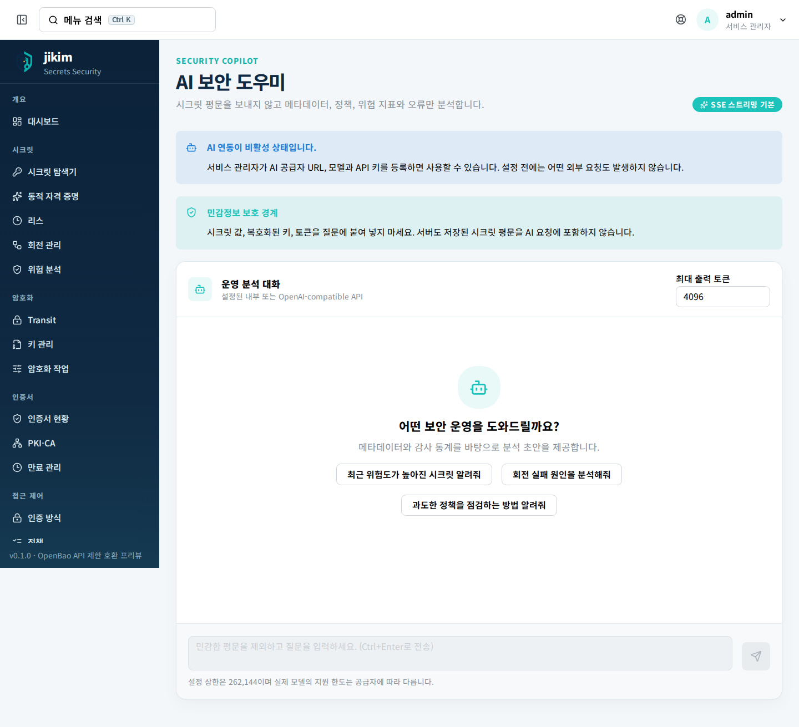

- 응답은 스트리밍으로 표시되고 **응답 중지**를 누르면 진행 중인 요청이 취소됩니다.
- 비밀번호·API Key·세션 토큰·개인 키·DSN처럼 시크릿 평문으로 보이는 입력은 서버가 거부합니다.
- 브라우저가 별도 컨텍스트를 보내도 Upstream에는 전달되지 않습니다. 역할에 맞춘 서버 집계만
  컨텍스트로 쓰입니다.
- 사용자별로 분당 30회, 동시 2개 요청까지입니다. 넘으면 `429`가 표시되므로 열려 있는 스트림을
  끝내고 60초 뒤에 다시 시도합니다.
- 답변은 검토용 초안입니다. 정책 적용이나 승인 결과가 아니므로 실제 변경 전에 정책 시뮬레이터와
  담당자 확인을 거칩니다.

### 3.8 API 탐색기

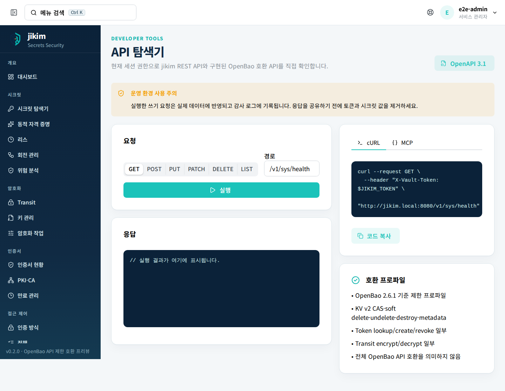

- 메서드와 경로를 고르고 **실행**을 누르면 지금 로그인한 세션 권한으로 요청이 나갑니다.
  **쓰기 요청은 실제 데이터에 반영되고 감사 로그에 남습니다.**
- 오른쪽에서 같은 요청의 **cURL**·**MCP** 예시를 복사할 수 있습니다. 복사한 내용을 공유하기 전에
  토큰과 시크릿 값을 지우십시오.
- **OpenAPI 3.1** 버튼은 `/api/openapi.json` 문서를 엽니다.
- 오른쪽 아래 **호환 프로파일** 카드가 지금 구현된 OpenBao 호환 범위를 그대로 보여 줍니다.

### 3.9 빠른 사용 가이드

상단 오른쪽 **도움말** 아이콘을 누르면 화면 안의 요약 가이드가 열립니다.

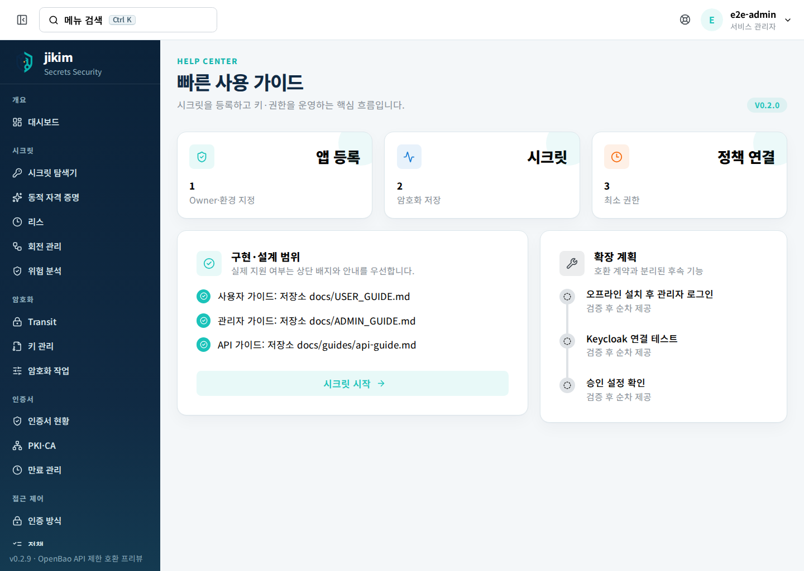

---

## 4. 자주 하는 작업

### 4.1 새 서비스에 쓸 자격 증명을 등록한다

1. **애플리케이션**에서 그 서비스가 카탈로그에 있는지 확인하고, 없으면 등록을 요청합니다
   (등록은 `admin`·`manager` 권한이 필요합니다).
2. **시크릿 탐색기 → 시크릿 만들기**로 `<앱>/<환경>/<자원>` 경로를 만듭니다.
3. Owner와 태그를 채웁니다. 위험도 카드에서 감점 요인이 사라지는지 확인합니다.
4. 그 서비스를 배포하는 계정이 값을 읽을 수 있는지 **정책 시뮬레이터**로 확인합니다.

### 4.2 유출이 의심되는 값을 바꾼다

1. 상세 화면 **값 변경**으로 새 값과 변경 사유를 넣어 새 버전을 만듭니다.
2. 대상 데이터베이스·외부 API에 새 값을 반영합니다. jikim이 대신 반영하지 않습니다.
3. **감사 로그**에서 그 경로의 최근 `값 조회` 기록을 확인해 누가 언제 열었는지 정리합니다.
4. 계정이 노출됐다면 **접근 제어 → 토큰**에서 해당 사용자의 API 토큰을 폐기합니다.

### 4.3 담당자가 바뀌어 인수인계한다

1. **시크릿 탐색기**에서 Owner로 검색해 넘길 목록을 뽑습니다.
2. `v0.2.11`의 화면에는 이미 만든 시크릿의 Owner 표시나 애플리케이션 연결만 고치는 편집
   기능이 없습니다. 표기를 정리해야 하면 새 값으로 다시 등록하고 예전 경로를 **격리**하거나,
   관리자에게 `PATCH /api/v1/secrets/{id}` 처리를 요청합니다.
3. 새 담당자에게 필요한 정책이 붙어 있는지 **접근 정책**에서 확인하고, 떠나는 사람에게 붙은
   정책은 관리자에게 해제를 요청합니다.

### 4.4 감사 자료를 제출한다

1. **감사 로그**에서 사용자·작업·리소스·IP로 검색하고 **결과**로 성공·실패·거부를 걸러 냅니다.
2. **CSV 내보내기**로 내려받습니다.
3. 제출 전에 파일에 시크릿 값이 없는지 확인합니다. 감사 로그에는 평문이 들어가지 않지만,
   내려받은 파일을 어디에 두는지는 제출하는 사람의 책임입니다.

### 4.5 내 개인 키를 회전한다

1. 프로필 메뉴 → **내 키·권한**으로 이동합니다.
2. **회전**을 누르고 확인 창의 안내를 읽습니다.
3. 새 버전 번호와 최근 회전 시각이 올라갔는지 확인합니다.
4. 감사 로그에 회전 기록이 남았는지 확인합니다. 실패하면 반복 실행하지 말고 요청 ID와 시각을
   관리자에게 전달합니다.

---

## 5. 막혔을 때

화면에 그대로 나오는 문구입니다. 관리자에게 넘겨야 하는 것은 그렇게 적었습니다.

| 화면에 보이는 문구 | 뜻과 해야 할 일 |
| --- | --- |
| `아이디 또는 비밀번호가 올바르지 않습니다` | 계정이나 비밀번호가 틀렸습니다. 몇 번 더 실패하면 잠시 잠깁니다. |
| `사용자 계정이 비활성화되었습니다` | 계정이 꺼져 있습니다. 관리자에게 활성화를 요청합니다. |
| `로컬 로그인이 비활성화되었습니다` | 이 서비스는 SSO만 허용합니다. **Keycloak SSO로 로그인**을 쓰십시오. |
| `로그인 시도가 너무 많습니다. 잠시 후 다시 시도하세요` | 실패 제한에 걸렸습니다. 응답의 `Retry-After` 시간만큼 기다립니다. |
| `SSO 로그인을 완료하지 못했습니다.` | SSO 복귀가 실패했습니다. 로그인 화면에서 다시 시작하고, 반복되면 발생 시각을 관리자에게 전달합니다. |
| `로그인 코드가 만료되었거나 이미 사용되었습니다` | SSO 복귀 URL을 재사용했습니다. 복귀 주소를 복사·공유하지 말고 처음부터 다시 로그인합니다. |
| `Secret 조회 권한이 없습니다` / `Secret 값 조회 권한이 없습니다` | 목록은 보이지만 값 열기 권한이 없습니다. 필요한 경로와 이유를 관리자에게 전달합니다. |
| `Secret 생성 권한이 없습니다` / `Secret 변경 권한이 없습니다` | 그 경로에 쓰기 권한이 없습니다. 정책 추가를 요청합니다. |
| `Secret 조회 사유를 3~500자로 입력하세요` | 사유가 너무 짧거나 깁니다. 왜 열어야 하는지 문장으로 적습니다. |
| `자동 회전 가능한 필드가 없어 새 data 값이 필요합니다` | 수동 회전으로 바꿀 수 있는 필드가 없습니다. **값 변경**으로 새 값을 직접 넣습니다. |
| `감사 로그를 저장할 수 없어 Secret 값을 표시하지 않습니다` | 기록을 남길 수 없는 상태라 값을 일부러 보여 주지 않습니다. 재시도하지 말고 관리자에게 알립니다. |
| `설정된 검토자 역할이 아닙니다` | 승인 권한이 없습니다. 관리자가 지정한 검토 역할을 확인합니다. |
| `AI 기능이 설정되지 않았습니다` | 관리자가 AI를 켜지 않았습니다. |
| `AI API에 연결할 수 없습니다` / `AI API가 요청을 거부했습니다` | 연결한 AI 서비스 쪽 문제입니다. 요청 ID와 시각을 관리자에게 전달합니다. |
| `데이터베이스 연결을 확인할 수 없습니다` | 서비스가 저장소에 닿지 못합니다. 관리자 확인이 필요합니다. |
| `서버 내부 오류가 발생했습니다` | 요청 ID, 시각, 화면 이름을 적어 관리자에게 전달합니다. |
| `요청한 API를 찾을 수 없습니다` | 주소가 잘못되었습니다. 메뉴로 다시 이동합니다. |

권한이 없는 화면을 열면 빈 화면이 아니라 안내 화면으로 이동합니다.

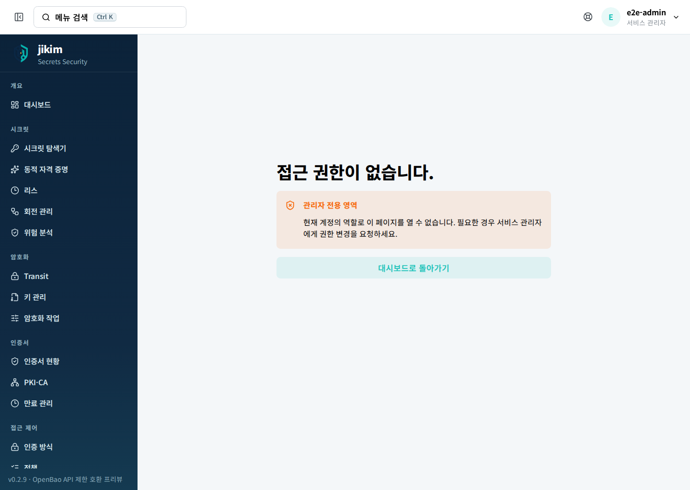

없는 주소를 열면 다음 화면이 나옵니다.

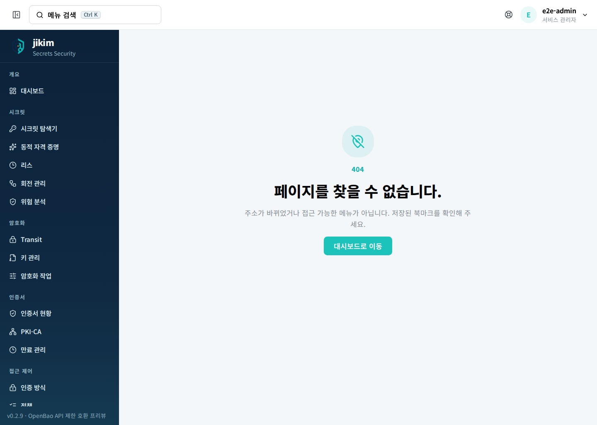

오류를 보고할 때 화면 캡처를 첨부한다면, 시크릿 값이 열려 있었는지 먼저 확인하고 마스킹한 뒤에
보내십시오.

---

## 6. 용어

| 화면에 나오는 말 | 뜻 |
| --- | --- |
| 시크릿 | jikim이 암호화해 보관하는 값 하나. 경로로 식별합니다. |
| 경로 | 시크릿의 이름. `애플리케이션/환경/자원` 형태를 권장합니다. |
| 버전 | 값을 바꿀 때마다 올라가는 번호. 이전 버전은 남습니다. |
| Owner | 그 시크릿의 책임 조직 표시. 비면 위험 점수가 올라갑니다. |
| 환경 | DEV(개발)·STG(검증)·PRD(운영) 구분. |
| 위험도 · 위험 점수 | 저장 시 계산하는 0\~100 값. 운영 경로, Owner 부재, 고권한 필드 이름이 점수를 올립니다. |
| capability | 정책이 허용하는 작업 단위. 조회·목록·생성·변경·삭제·회전·암호화·복호화. |
| 정책 | 경로 패턴과 capability의 묶음. 사용자에게 붙여서 권한을 만듭니다. |
| 개인 키 | 사용자별 데이터 키를 감싸는 키. 회전하면 버전이 올라갑니다. |
| 회전 | 값이나 키를 새 버전으로 바꾸는 일. 이전 버전은 복호화를 위해 남습니다. |
| 격리 | 더 쓰지 않을 시크릿을 비활성으로 표시하는 일. |
| Transit | 애플리케이션이 원본 키를 보지 않고 API로 암·복호화하는 기능. |
| 감사 로그 | 누가 언제 어떤 리소스에 어떤 작업을 했는지의 기록. 평문은 없습니다. |
| 이벤트 ID · 요청 ID | 기록 한 건을 가리키는 식별자. 문의할 때 이 값을 전달합니다. |
| 프리뷰 | 화면은 있으나 엔진이 아직 없는 영역. 배지와 안내 문구로 표시됩니다. |
